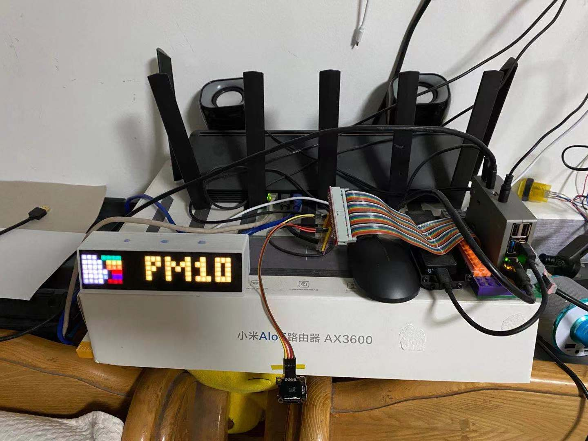

# 树莓派天气语音播报

## 功能
- [x] 循环播放音乐
- [x] 手势控制
- [x] 获取当日天气预报
- [x] 播放天气预报
- [ ] 

## 控制方式手势识别
gesture.py 手势控制 主模块

## 天气获取方式爬虫
weather_tts.py 天气

## 语音
离线语音播放采用 Offline_speech_synthesis项目

## weather_tts.service 增加系统服务
sudo cp weather_tts.service  /lib/systemd/system

## 硬件环境
树莓派4
hp小音箱
PAJ7620U2 手势识别模块

* 